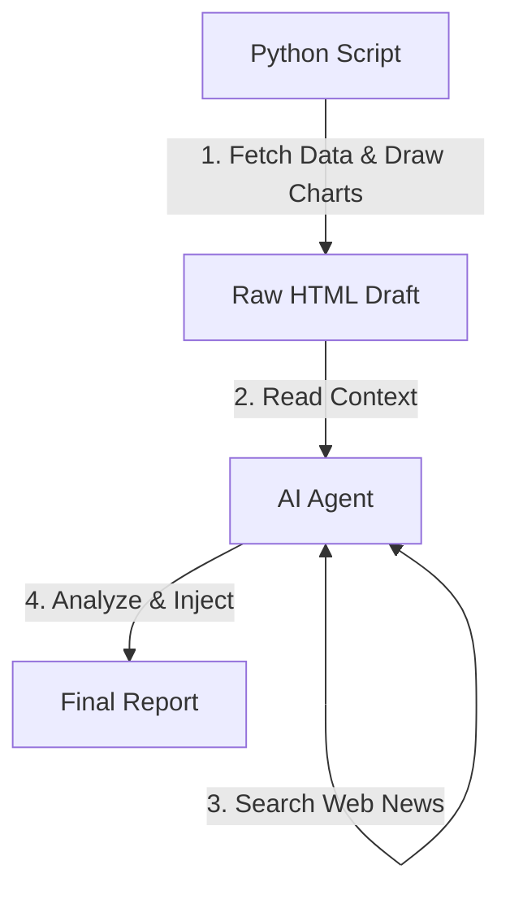

# 投資分析自動化專案 (Investment Analysis Automation)

這是一個結合 **Python 自動化腳本** 與 **AI 智慧分析** 的投資輔助工具。旨在每週自動抓取美股、台股 ETF 及債券市場數據，計算關鍵技術指標，繪製 K 線圖，並結合 AI 代理人生成深度市場觀點與即時新聞彙整，最終產出一份易於閱讀的 HTML 綜合分析報告。

## 主要功能

1.  **多市場數據追蹤**：支援追蹤美股指數（如 S&P 500, 費半）、台股熱門 ETF（如 0050, 0056）、個股及債券 ETF。
2.  **自動化技術指標計算**：
    *   **KD 指標**：判斷超買/超賣區間與趨勢強弱。
    *   **乖離率 (BIAS)**：計算 5日、20日、60日 乖離，判斷股價是否過熱或超跌。
    *   **DMI & ADX**：判斷多/空趨勢方向與強度。
    *   **移動平均線 (MA)**：計算 5MA, 20MA, 60MA。
3.  **視覺化圖表生成**：自動繪製包含均線與成交量的 K 線圖，以及美國長短期公債殖利率曲線圖。
4.  **獨立的財經焦點專區**：
    *   自動收集與美台經濟、匯率、利率相關的真實重要新聞，提供連結與摘要，讓使用者快速掌握市場脈動。
    *   放置在專屬的 **`#weekly-news-focus`** 區塊。
5.  **AI 深度綜合分析**：
    *   報告包含專屬的 **`#ai-analysis-report`** 區塊。
    *   **技術面**：分析量價結構與指標背離。
    *   **基本面**：運用財報數據評估護城河與安全邊際。
    *   **總經面**：結合自動抓取的宏觀數據解讀市場週期。
6.  **專業級報告風格**：
    *   嚴格執行 **No-Emoji Policy**：程式碼日誌與報告內容均不使用表情符號，確保輸出的專業性與簡潔度。
    *   採用 **台股紅漲綠跌** 的 K 線配色慣例，符合本地使用者習慣。
7. **總體經濟指標監控**：自動追蹤美台核心經濟數據，包含：
    *   **美國**：GDP 成長率、非農就業人數、失業率、ISM 製造業 PMI、美元指數 (DXY)。
    *   **台灣**：景氣對策信號 (燈號)、外銷訂單、失業率、加班工時、融資餘額、融券餘額。
8. **財經新聞彙整**：


---

## 專案結構

*   `investment_analysis.py`: 核心 Python 腳本。負責抓取 `yfinance` 數據、計算指標、繪圖並生成 HTML 報告框架。
*   `config.json`: 設定檔。管理追蹤清單、群組分類與中文名稱對照。
*   `report/`: 存放生成的 HTML 日報 (檔名格式：`invest_analysis_YYYYMMDD.html`)。
*   `README.md`: 專案說明文件。

## 開發者日誌規範
本專案的 Python 腳本輸出遵循標準化格式，不包含表情符號，方便日誌分析：
*   `[Info]`: 一般執行進度與資訊。
*   `[Warning]`: 非致命性問題（如：部分數據抓取失敗）。
*   `[Error]`: 程式錯誤或例外狀況。
*   `[Success]`: 關鍵任務完成（如：報告生成成功）。

---

## 運作方式與流程

本專案採用「雙階段處理」架構，結合 Python 的數據處理能力與 AI 的邏輯分析能力。



本專案建議搭配 AI Agent (如 Gemini CLI) 使用以獲得完整體驗。運作流程如下：

1.  **執行腳本**：讓AI Agent(或手動)執行 `investment_analysis.py`。
    *   程式讀取 `config.json`。
    *   抓取歷史股價數據。
    *   計算指標並判斷趨勢訊號（如：多頭排列、空頭修正）。
    *   根據數據繪製圖表並轉換為 Base64 嵌入 HTML檔案中。
    *   生成包含數據表格與圖表的原始報告 (HTML檔案)。
2.  **AI 分析與注入** (由 AI Agent 完成)：
    *   讀取腳本所生成的原始報告。
    *   **資訊搜集**：搜尋最新的財經新聞與總經數據。
    *   **內容生成**：分別撰寫「本週財經焦點」與「AI 綜合分析」兩份內容。
    *   **精準注入**：
        *   新聞內容注入至 HTML 的 `<div id="weekly-news-focus">`。
        *   分析內容注入至 HTML 的 `<div id="ai-analysis-report">`。

---

## 安裝與設定

### 1. 複製專案
請將專案複製到您的本地工作區域：
```bash
git clone https://github.com/GwanlinHo/investment_analysis.git
cd investment_analysis
```

### 2. 環境需求
*   Python 3.8 或以上版本。
*   安裝必要的 Python 套件：
    ```bash
    pip install yfinance pandas matplotlib mplfinance pytz
    ```

### 3. 設定追蹤清單 (`config.json`)
您可以透過修改 `config.json` 來自定義想追蹤的標的。檔案結構如下：

*   **`stock_groups`**: 定義報告中的分類群組。
    ```json
    {
      "title": "群組名稱 (如：美股)",
      "symbols": ["代碼1", "代碼2", ...],
      "description": "群組描述"
    }
    ```
*   **`key_indicators`**: 定義哪些標的會出現在報告最上方的「市場速覽」區塊。
*   **`symbol_name_map`**: 定義股票代碼對應的中文名稱 (若未設定則顯示代碼)。

**修改範例**：若要新增追蹤「特斯拉 (TSLA)」，請在 `stock_groups` 的對應陣列中加入 `"TSLA"`，並在 `symbol_name_map` 加入 `"TSLA": "特斯拉"`。

---

## AI Agent 協作指南 (AI Agent Collaboration Guide)

本專案的核心價值在於**「自動化程式碼」與「AI 分析能力」的結合**。讓 Python 腳本收集並且計算數據，讓 AI Agent 蒐集最新的新聞、解讀市場情緒，並且進行深入的分析。

### 1. Gemini CLI 協作模式 (預設)

本專案已內建 Gemini CLI 的整合設定。

*   **觸發機制**：
    您只需要在 Gemini CLI 中輸入關鍵字：**`investment analysis`**。
*   **背後原理**：
    專案中的 `GEMINI.md` (或 `.gemini/GEMINI.md`) 扮演了「系統提示詞 (System Prompt)」的角色。當 AI 讀取到此檔案時，它會知道當使用者輸入特定關鍵字時，必須依序執行以下動作：
    1.  **執行腳本**：`python3 investment_analysis.py`。
    2.  **讀取檔案**：讀取生成的原始報告內容。
    3.  **網路搜尋**：使用 Google Search 尋找近期美股、台股與匯市的真實新聞（且附上來源連結）。
    4.  **角色扮演分析**：切換成 (1)技術分析、(2)價值分析、(3)宏觀分析 三種人格進行多角度分析。
    5.  **寫入檔案**：將新聞與分析結果寫回原始報告中，形成完整的報告。
    6.  **Git 操作**：自動上傳報告到遠端(github)伺服器。

### 2. 搭配其他 AI Agent (如 Claude Code, Codex, Cursor)

這套「以檔案為基礎的上下文注入 (File-based Context Injection)」概念可以輕易移植到其他 AI 程式設計工具。


---

## 報告閱讀指南

生成的 HTML 報告包含以下關鍵資訊：

### 導覽列功能
報告頂部提供快速導覽按鈕，包含：
*   **美股 / 台股 / 債券**：快速跳轉至各市場報價與 K 線圖。
*   **總經資訊**：查看美國公債殖利率曲線及美台重要經濟指標表格。
*   **財經焦點**：瀏覽本週重要財經新聞摘要。
*   **AI分析**：閱讀 AI 針對技術面、基本面與總經面的綜合評估。

### 1. 技術訊號徽章 (Badges)
| 訊號 | 顏色 | 意義 | 判斷邏輯 |
| :--- | :--- | :--- | :--- |
| **多頭排列** | <span style="color:red">紅色</span> | 強勢上漲 | K > D 且 月線乖離 > 0 |
| **反彈** | <span style="color:lightcoral">淡紅</span> | 弱勢反彈 | K > D 但 月線乖離 < 0 |
| **回檔整理** | <span style="color:lightgreen">淡綠</span> | 多頭回調 | K < D 但 月線乖離 > 0 |
| **空頭修正** | <span style="color:green">綠色</span> | 趨勢向下 | K < D 且 月線乖離 < 0 |

### 2. 關鍵指標解讀
*   **K9 / D9**: KD 隨機指標。
    *   **> 80**: 超買區 (可能回檔，但也可能鈍化強漲)。
    *   **< 20**: 超賣區 (可能反彈)。
    *   **K > D**: 黃金交叉 (偏多)。
    *   **K < D**: 死亡交叉 (偏空)。
*   **乖離率 (BIAS)**: 股價與均線的距離百分比。
    *   **正值**: 股價在均線上。**負值**: 股價在均線下。
    *   數值過大代表短線過熱或超跌。
*   **ADX**: 趨勢強度指標。數值越高代表目前趨勢（無論多空）越強。通常 > 25 代表有明顯趨勢。
*   **+DI / -DI**: 方向指標。+DI 在上代表多方佔優，-DI 在上代表空方佔優。
*   **量比%**: 當日成交量與過去 20 日平均成交量的比值。
    *   **> 100%**: 代表今日成交量大於 20 日均量，動能增強。
    *   **< 100%**: 代表今日成交量小於 20 日均量，動能縮減。
*   **殖利率倒掛 (Yield Curve Inversion)**:
    *   指「短期公債殖利率」高於「長期公債殖利率」的異常現象。
    *   歷史上常被視為**經濟衰退**的領先指標 (因為市場預期未來利率會下降，導致長債殖利率走低)。

### 3. 總體經濟數據儀表板 (Macro Dashboard)
報告中列出美國與台灣的關鍵總經數據，協助判斷大環境風險：
*   **趨勢箭頭 (▲/▼)**：直觀呈現數據較前一期或預期的增減方向。
*   **顏色編碼**：
    *   <span style="color:red">紅色</span>：通常代表正向擴張（如 GDP 增加、景氣燈號好轉）或偏多訊號（如融資增加）。
    *   <span style="color:green">綠色</span>：通常代表收縮、改善（如失業率下降）或避險訊號。
*   **景氣對策信號**：台灣國發會發布，黃紅燈/紅燈代表景氣熱絡，藍燈代表低迷。
*   **融資/融券餘額**：觀測市場籌碼面與散戶情緒。

### 4. 三位 AI 大師觀點
*   **技術大師**：告訴你現在「怎麼操作」（進出場點、型態風險）。
*   **價值大師**：告訴你現在「值不值得買」（便宜還是貴）。
*   **總經大師**：告訴你「大環境安不安全」（利率、戰爭、政策風險），**並會自動結合上述的總經數據進行解讀**。

---

## ⚠️ 免責聲明
本專案生成的報告僅供研究與參考，不構成任何投資建議。金融市場變化莫測，投資前請務必自行審慎評估風險。
