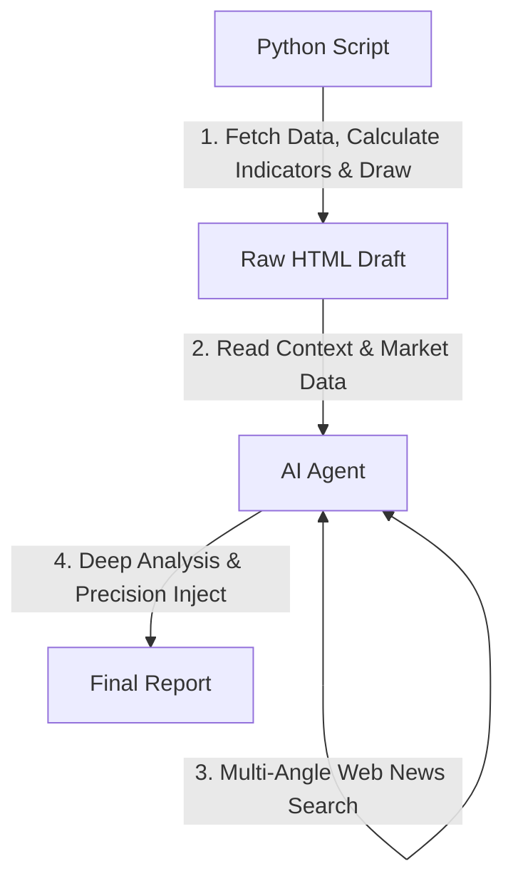

# 投資分析自動化專案 (Investment Analysis Automation)

這是一個結合 **Python 自動化腳本** 與 **AI 智慧分析** 的投資輔助工具。旨在每週自動抓取美股、台股 ETF 及債券市場數據，計算關鍵技術指標，繪製 K 線圖，並結合 AI 代理人生成深度市場觀點與即時新聞彙整，最終產出一份易於閱讀的 HTML 綜合分析報告。
當然，一週要觸發多少次，以及每次要收集哪些資料，完全可以由使用者自行調整。

## 主要功能

1.  **多市場數據追蹤**：支援追蹤美股指數（如 S&P 500, 費半）、台股熱門 ETF（如 0050, 0056）、個股及債券 ETF。
2.  **自動化技術指標計算**：
    *   **KD 指標**：判斷超買/超賣區間與趨勢強弱。
    *   **乖離率 (BIAS)**：計算 5日、20日、60日 乖離，判斷股價是否過熱或超跌。
    *   **DMI & ADX**：判斷多/空趨勢方向與強度。
    *   **移動平均線 (MA)**：計算 5MA, 20MA, 60MA。
3.  **視覺化圖表生成**：自動繪製包含均線與成交量的 K 線圖，以及美國長短期公債殖利率曲線圖。
4.  **獨立的財經焦點專區**：
    *   自動收集與美台經濟、匯率、利率相關的真實重要新聞，提供連結與摘要，讓使用者快速掌握市場脈動。
    *   放置在專屬的 **`#weekly-news-focus`** 區塊。
5.  **AI 深度綜合分析**：
    *   報告包含專屬的 **`#ai-analysis-report`** 區塊。
    *   **技術面**：分析量價結構與指標背離。
    *   **基本面**：運用財報數據評估護城河與安全邊際。
    *   **總經面**：結合自動抓取的宏觀數據解讀市場週期。
6.  **專業級報告風格**：
    *   嚴格執行 **No-Emoji Policy**：程式碼日誌與報告內容均不使用表情符號，確保輸出的專業性與簡潔度。
    *   採用 **台股紅漲綠跌** 的 K 線配色慣例，符合本地使用者習慣。
7. **總體經濟指標監控**：自動追蹤美台核心經濟數據，包含：
    *   **美國**：GDP 成長率、CPI (消費者物價指數)、PPI (生產者物價指數)、零售銷售、非農就業人數、失業率、初次請領失業救濟金人數、ISM 製造業指數、M2 貨幣供給、信用卡違約率、實質民間投資、美元指數 (DXY)。
    *   **台灣**：景氣對策信號 (燈號)、外銷訂單年增率、工業生產指數、消費者信心指數 (CCI)、M1B & M2 貨幣供給、信用卡違約率 (逾期比)、實質民間投資、失業率、加班工時、融資餘額、融券餘額。
8. **財經新聞彙整**：

---

## 權威資料來源 (Authoritative Data Sources)

為了確保分析的專業性與準確性，本專案嚴格限制 AI Agent 僅能從各國政府官方統計機構獲取最新的**正式發布數據**，嚴禁使用預測值或非官方估計。

### 1. 總體經濟數據 (Macro Data)
*   **美國 (US)**:
    *   **BEA (經濟分析局)**: GDP (國內生產總值)、實質民間投資。
    *   **BLS (勞工統計局)**: CPI (消費者物價指數)、PPI (生產者物價指數)、非農就業人數、失業率。
    *   **美國商務部**: 零售銷售。
    *   **美國勞工部**: 初次請領失業救濟金人數。
    *   **ISM (供應管理協會)**: ISM 製造業指數。
    *   **Federal Reserve (聯準會)**: M2 貨幣供給、信用卡違約率 (Delinquency Rate)。
    *   **Yahoo Finance**: 美元指數 (DXY)、公債殖利率。
*   **台灣 (Taiwan)**:
    *   **國發會**: [景氣對策信號 (燈號)](https://index.ndc.gov.tw/n/zh_tw) (確保獲取最新分數與顏色)、外銷訂單年增率。
    *   **經濟部**: 工業生產指數。
    *   **中央銀行**: M1B & M2 貨幣供給。
    *   **金管會**: 信用卡逾期帳款比率 (違約率)。
    *   **中央大學台灣經濟發展研究中心**: 消費者信心指數 (CCI)。
    *   **主計總處**: 實質民間投資 (固定資本形成)、失業率、加班工時。
    *   **證交所 (TWSE)**: 融資餘額、融券餘額。

### 2. 即時新聞與市場數據 (Real-time Context)
*   **市場數據**: 直接調用 **Yahoo Finance (yfinance) API** 獲取歷史價格、技術指標與企業財報基本面數據。
*   **財經新聞**: 遵循嚴格的 **新聞查核協議 (News Verification Protocol)**，確保每則新聞的真實性與準確性。

---

## 新聞查核機制 (News Verification Protocol)

為了防止 AI 產生幻覺或抓取錯誤資訊，本專案實施以下查核措施：

### 1. 權威媒體白名單 (Tier-1 Source Whitelist)
AI Agent 僅能從以下全球及本土主流財經媒體搜集資訊：
*   **全球 (Global)**: Bloomberg, Reuters, The Wall Street Journal (WSJ), Financial Times, CNBC, Barron's.
*   **台灣 (Taiwan)**: 經濟日報、工商時報、中央通訊社 (CNA)、鉅亨網 (Anue)。
*   **嚴格禁制**: 社交媒體 (如 X/Facebook)、個人部落格、內容農場、或任何標題誇張的非專業網站。

### 2. 多重驗證與數據一致性
*   **交叉比對 (Triangulation)**: 對於重大市場事件 (如聯準會決策、關鍵經濟數據)，AI 必須同時找到 **2 家以上** 不同媒體體系的報導才可採納。
*   **時效性檢查 (Recency Check)**: 所有新聞發布時間必須在 **7 天內**，避免舊聞重貼。
*   **數據一致性 (Consistency Check)**: 新聞內容中的經濟指標數值必須與本報告中抓取的「官方總經數據」一致。若有衝突，AI 必須優先採納官方數據並捨棄該則新聞。
*   **強烈真實性 (Verifiability)**: 每一則新聞都必須附帶指向原文的 **直接來源連結** (Direct Link)，方便人工複查。

---

## 專案結構


*   `investment_analysis.py`: 核心 Python 腳本。負責抓取 `yfinance` 數據、計算指標、繪圖，並透過 `jinja2` 模板引擎產出 HTML 報告。
*   `templates/`: 存放 HTML 報告模板 (`report_template.html`)，讓報告格式與邏輯分離。
*   `config.json`: 設定檔。管理追蹤清單、群組分類與中文名稱對照。
*   `report/`: 存放生成的 HTML 日報 (檔名格式：`invest_analysis_YYYYMMDD.html`)。
*   `GEMINI.md`: 定義 AI Agent 的協作邏輯、總經數據抓取規則與自動化流程。
*   `requirements.txt`: 專案依賴清單。
*   `README.md`: 專案說明文件。


---

## 運作方式與流程

本專案採用「雙階段處理」架構，結合 Python 的數據處理能力與 AI 的邏輯分析能力。



本專案建議搭配 AI Agent (如 Gemini CLI) 使用以獲得完整體驗。運作流程如下：

1.  **執行腳本**：讓 AI Agent (或手動) 執行 `investment_analysis.py`。
    *   程式讀取 `config.json`。
    *   抓取歷史股價數據與指標。
    *   使用 `jinja2` 渲染 `templates/report_template.html`。
    *   根據數據繪製圖表並轉換為 Base64 嵌入 HTML 檔案中。
    *   生成包含數據表格與圖表的原始報告 (HTML 檔案)。
2.  **AI 分析與注入** (由 AI Agent 完成)：
    *   讀取腳本所生成的原始報告及其嵌入的 `market-data`。
    *   **資訊搜集**：執行多重搜尋（美股總經、台股科技、風險與財報）尋找最新真實新聞。
    *   **內容生成**：撰寫「本週財經焦點」與「AI 綜合分析」（含技術、基本、總經面）。
    *   **精準注入**：
        *   總經指標注入至 `us-macro-placeholder` 與 `tw-macro-placeholder`。
        *   新聞內容注入至 `#weekly-news-focus`。
        *   分析報告注入至 `#ai-analysis-report`。

---

## 安裝與設定

### 1. 複製專案
請將專案複製到您的本地工作區域：
```bash
git clone https://github.com/GwanlinHo/investment_analysis.git
cd investment_analysis
```

### 2. 環境需求與設定
*   Python 3.9 或以上版本。
*   推薦使用 **uv** (現代化 Python 封裝工具) 以獲得最佳效能：
    ```bash
    # 使用 uv 執行 (自動管理環境)
    uv run investment_analysis.py
    ```
*   傳統 pip 方式：
    ```bash
    python3 -m venv .venv
    source .venv/bin/activate  # Linux/macOS
    pip install -r requirements.txt
    python3 investment_analysis.py
    ```

### 3. 設定追蹤清單 (`config.json`)
您可以透過修改 `config.json` 來自定義想追蹤的標的。檔案結構如下：

*   **`stock_groups`**: 定義報告中的分類群組。
    ```json
    {
      "title": "群組名稱 (如：美股)",
      "symbols": ["代碼1", "代碼2", ...],
      "description": "群組描述"
    }
    ```
*   **`key_indicators`**: 定義哪些標的會出現在報告最上方的「市場速覽」區塊。
*   **`symbol_name_map`**: 定義股票代碼對應的中文名稱 (若未設定則顯示代碼)。

**修改範例**：若要新增追蹤「特斯拉 (TSLA)」，請在 `stock_groups` 的對應陣列中加入 `"TSLA"`，並在 `symbol_name_map` 加入 `"TSLA": "特斯拉"`。

---

## 自動化執行 (Automation)

您可以透過設定 `crontab` 來實現定時自動執行分析並上傳報告。

### 1. 建立執行腳本
建立一個檔案 (例如 `run_analysis.sh`) 並貼入以下內容 (請根據您的環境修改路徑)：

```bash
#!/bin/bash
export PATH=$PATH:/home/pi/.config/nvm/versions/node/v22.17.0/bin
cd /home/pi/WorkDir/investment_analysis/
gemini -p 'investment analysis' -y
```

### 2. 設定 Crontab
執行 `crontab -e` 並加入以下排程 (例如：每週一至五 晚上 10 點執行)：

```bash
0 22 * * 1-5 /bin/bash /home/pi/WorkDir/investment_analysis/run_analysis.sh >> /home/pi/WorkDir/investment_analysis/auto_run.log 2>&1
```

---

## AI Agent 協作指南 (AI Agent Collaboration Guide)

本專案的核心價值在於**「自動化程式碼」與「AI 分析能力」的結合**。讓 Python 腳本收集並且計算數據，讓 AI Agent 蒐集最新的新聞、解讀市場情緒，並且進行深入的分析。

### 1. Gemini CLI 協作模式 (預設)

本專案已內建 Gemini CLI 的整合設定。

*   **觸發機制**：
    您只需要在 Gemini CLI 中輸入關鍵字：**`investment analysis`**。
*   **背後原理**：
    專案中的 `GEMINI.md` (或 `.gemini/GEMINI.md`) 扮演了「系統提示詞 (System Prompt)」的角色。當 AI 讀取到此檔案時，它會知道當使用者輸入特定關鍵字時，必須依序執行以下動作：
    1.  **執行腳本**：`python3 investment_analysis.py`。
    2.  **讀取檔案**：讀取生成的原始報告內容。
    3.  **網路搜尋**：使用 Google Search 尋找近期美股、台股與匯市的真實新聞（且附上來源連結）。
    4.  **角色扮演分析**：切換成 (1)技術分析、(2)價值分析、(3)宏觀分析 三種人格進行多角度分析。
    5.  **寫入檔案**：將新聞與分析結果寫回原始報告中，形成完整的報告。
    6.  **Git 操作**：自動上傳報告到遠端(github)伺服器。

### 2. 搭配其他 AI Agent (如 Claude Code, Codex, Cursor)

這套「以檔案為基礎的上下文注入 (File-based Context Injection)」概念可以輕易移植到其他 AI 程式設計工具。


---

## 報告閱讀指南

生成的 HTML 報告包含以下關鍵資訊：

### 導覽列功能
報告頂部提供快速導覽按鈕，包含：
*   **美股 / 台股 / 債券**：快速跳轉至各市場報價與 K 線圖。
*   **總經資訊**：查看美國公債殖利率曲線及美台重要經濟指標表格。
*   **財經焦點**：瀏覽本週重要財經新聞摘要。
*   **AI分析**：閱讀 AI 針對技術面、基本面與總經面的綜合評估。

### 1. 技術訊號徽章 (Badges)
| 訊號 | 顏色 | 意義 | 判斷邏輯 |
| :--- | :--- | :--- | :--- |
| **多頭排列** | <span style="color:red">紅色</span> | 強勢上漲 | K > D 且 月線乖離 > 0 |
| **反彈** | <span style="color:lightcoral">淡紅</span> | 弱勢反彈 | K > D 但 月線乖離 < 0 |
| **回檔整理** | <span style="color:lightgreen">淡綠</span> | 多頭回調 | K < D 但 月線乖離 > 0 |
| **空頭修正** | <span style="color:green">綠色</span> | 趨勢向下 | K < D 且 月線乖離 < 0 |

### 2. 關鍵指標解讀
*   **K9 / D9**: KD 隨機指標。
    *   **> 80**: 超買區 (可能回檔，但也可能鈍化強漲)。
    *   **< 20**: 超賣區 (可能反彈)。
    *   **K > D**: 黃金交叉 (偏多)。
    *   **K < D**: 死亡交叉 (偏空)。
*   **乖離率 (BIAS)**: 股價與均線的距離百分比。
    *   **正值**: 股價在均線上。**負值**: 股價在均線下。
    *   數值過大代表短線過熱或超跌。
*   **ADX**: 趨勢強度指標。數值越高代表目前趨勢（無論多空）越強。通常 > 25 代表有明顯趨勢。
*   **+DI / -DI**: 方向指標。+DI 在上代表多方佔優，-DI 在上代表空方佔優。
*   **量比%**: 當日成交量與過去 20 日平均成交量的比值。
    *   **> 100%**: 代表今日成交量大於 20 日均量，動能增強。
    *   **< 100%**: 代表今日成交量小於 20 日均量，動能縮減。
*   **殖利率倒掛 (Yield Curve Inversion)**:
    *   指「短期公債殖利率」高於「長期公債殖利率」的異常現象。
    *   歷史上常被視為**經濟衰退**的領先指標 (因為市場預期未來利率會下降，導致長債殖利率走低)。

### 3. 總體經濟數據儀表板 (Macro Dashboard)
報告中列出美國與台灣的關鍵總經數據，協助判斷大環境風險：
*   **趨勢箭頭 (▲/▼)**：直觀呈現數據較前一期或預期的增減方向。
*   **顏色編碼**：
    *   <span style="color:red">紅色</span>：通常代表正向擴張（如 GDP 增加、景氣燈號好轉）或偏多訊號（如融資增加）。
    *   <span style="color:green">綠色</span>：通常代表收縮、改善（如失業率下降）或避險訊號。
*   **景氣對策信號**：台灣國發會發布，黃紅燈/紅燈代表景氣熱絡，藍燈代表低迷。
*   **融資/融券餘額**：觀測市場籌碼面與散戶情緒。

### 4. 四大 AI 深度分析視角
*   **1. 宏觀環境定調**: 告訴你大環境處於經濟週期的哪個階段 (擴張/衰退/通膨)。
*   **2. 市場動態與產業趨勢**: 核心觀察**資金流向** (如美元對外資的影響) 與**產業估值** (如科技股回調風險)。
*   **3. 技術面與個股健檢**: 針對具體標的進行量價指標解析與基本面品質評估。
*   **4. 綜合對策與情境預測**: 提供不同市場情境下的**具體行動建議** (樂觀/中立/悲觀)。

---

## ⚠️ 免責聲明
本專案生成的報告僅供研究與參考，不構成任何投資建議。金融市場變化莫測，投資前請務必自行審慎評估風險。
